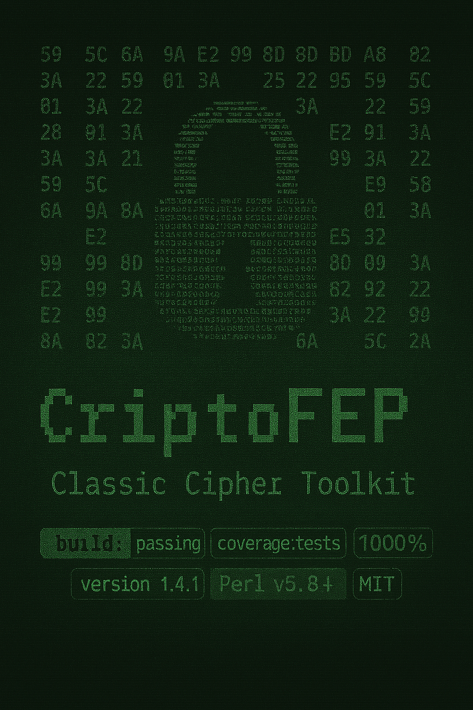

<div align="center">
  
  <h1>CriptoFEP — A Classic Cipher Toolkit</h1>
</div>

<div align="center">

[]()
[]()
[]()
[]()
[]()

</div>

<div align="center">

```
   ___|       _)         |           ____|  ____|   _ \  
  |       __|  |  __ \   __|   _ \   |      __|    |   | 
  |      |     |  |   |  |    (   |  __|    |      ___/  
 \____| _|    _|  .__/  \__| \___/  _|     _____| _|     
                 _|                                      
```

</div>

**CriptoFEP** is a powerful, educational, and modular command-line toolkit written in **Perl** for experimenting with classic cryptography. It provides a comprehensive arsenal of historical ciphers and modern encodings, making it the perfect tool for students, historians, puzzle enthusiasts, and Capture The Flag (CTF) competitors.

---

## 📋 Table of Contents

- [✨ Core Features](#-core-features)
- [📚 Available Ciphers & Encodings](#-available-ciphers--encodings)
- [🚀 Quick Start](#-quick-start)
- [🛠️ Usage Guide](#️-usage-guide)
  - [Synopsis](#synopsis)
  - [Command-Line Options](#command-line-options)
  - [Practical Examples](#practical-examples)
- [📂 Project Structure](#-project-structure)
- [✅ Roadmap](#-roadmap)
- [🤝 Contributing](#-contributing)
- [📜 License](#-license)

---

## ✨ Core Features

- **Extensive Library**: A vast collection of over 30 classic ciphers and 10+ standard encodings.
- **Dual Modes**: Intelligently separates **Ciphers** (for secrecy) from **Encodings** (for representation).
- **Professional CLI**: A robust and intuitive command-line interface with clear, consistent options.
- **File I/O**: Seamlessly encrypts/encodes direct text input or entire files, with output to the terminal or a new file.
- **Full Unicode Support**: Correctly handles a wide range of characters thanks to its UTF-8 architecture.
- **Dynamic Help**: An integrated `--info` flag provides detailed historical and technical explanations for each algorithm.
- **Modular & Extensible**: Built with a clean, modular architecture in `lib/CriptoFEP/`, making it easy to maintain and extend with new ciphers.

---

## 📚 Available Ciphers & Encodings

This is the complete list of algorithms currently supported by CriptoFEP.

### Ciphers (Key-based algorithms for confidentiality)

| Name               | Requires Key? | Description                                                                |
| -------------------| :-----------: | ---------------------------------------------------------------------------|
| **ADFGX**          |      Yes      | The original 5x5 WWI German field cipher combining Polybius and columnar.  |
| **ADFGVX**         |      Yes      | The advanced 6x6 version of ADFGX, including numbers.                      |
| **Affine**         |      Yes      | A mathematical substitution cipher using `(ax + b) mod 26`.                |
| **Albam**          |      No       | A simple substitution cipher that swaps the two halves of the alphabet.    |
| **AMSCO**          |      Yes      | An irregular columnar transposition using a 1-2 fill pattern.              |
| **Atbah**          |      No       | A simple substitution cipher with a specific, non-sequential mapping.      |
| **Atbash**         |      No       | A simple substitution cipher that reverses the alphabet (A=Z, B=Y...).     |
| **Bacon**          |      No       | A 5-bit binary encoding that maps letters to sequences of 'A's and 'B's.   |
| **Bifid**          |      Yes      | A fractionating cipher combining Polybius with transposition.              |
| **Caesar**         |      No       | The classic shift cipher (fixed shift of 3).                               |
| **Caesar Box**     |      Yes      | A simple columnar transposition where columns are read in natural order.   |
| **Columnar**       |      Yes      | A transposition cipher that rearranges text in columns based on a keyword. |
| **Digrafid**       |      Yes      | An advanced fractionating cipher operating on digraphs with a 25x25 grid.  |
| **Double Columnar**|      Yes      | Applies the Columnar Transposition cipher twice for enhanced security.     |
| **Four-Square**    |      Yes      | A polygraphic cipher using four 5x5 grids to encrypt digraphs.             |
| **Keyboard Shift** |      No       | A substitution cipher based on shifting keys on a QWERTY keyboard.         |
| **Morbit**         |      No       | A fractionating cipher that combines Morse code with a simple 3x3 grid.    |
| **Multiplicative** |      Yes      | A mathematical substitution cipher using `(ax) mod 26`.                    |
| **Nihilist**       |      Yes      | A superencipherment combining a Polybius square with a key addition.       |
| **Playfair**       |      Yes      | The first practical polygraphic substitution cipher, using one 5x5 grid.   |
| **Pollux**         |      Yes      | A homophonic cipher that disguises Morse code using a numeric key.         |
| **Rail Fence**     |      Yes      | A transposition cipher that writes text in a zig-zag pattern.              |
| **Redefence**      |      Yes      | A route cipher that writes text column-by-column and reads row-by-row.     |
| **ROT13**          |      No       | A Caesar cipher with a fixed shift of 13.                                  |
| **ROT47**          |      No       | A Caesar cipher that shifts all printable ASCII characters.                |
| **Route**          |   	Yes	     | A transposition cipher that writes text in a clockwise inward spiral path. |
| **Scytale**        |      No       | An ancient transposition cipher simulating a cylinder (fixed at 5 rows).   |
| **Skip**           |      Yes      | A simple transposition equivalent to a Caesar Box or basic Columnar.       |
| **Three-Square**   |      Yes      | A polygraphic cipher using three 5x5 grids.                                |
| **Trifid**         |      Yes      | An advanced fractionating cipher using a 3x3x3 cube.                       |
| **Turning Grille** |      No       | A transposition cipher using a rotating stencil with a fixed 6x6 grid.     |
| **Two-Square**     |      Yes      | A polygraphic cipher using two 5x5 grids.                                  |
| **VIC**            |      Yes      | A highly complex Cold War spy cipher.                                      |
| **Vigenère**       |      Yes      | A polyalphabetic cipher using a keyword (Autokey variant).                 |
| **XOR**            |      Yes      | A modern, bitwise symmetric cipher.                                        |


Of course. Here is the updated table with the **VIC Cipher** added in its correct alphabetical position.

You can copy and paste this entire markdown block to replace the table in your `README.md` file.

***
### Ciphers (Key-based algorithms for confidentiality)

| Name | Requires Key? | Description |
| :--- | :---: | :--- |
| **ADFGX** | Yes | The original 5x5 WWI German field cipher combining Polybius and columnar. |
| **ADFGVX** | Yes | The advanced 6x6 version of ADFGX, including numbers. |
| **Affine** | Yes | A mathematical substitution cipher using `(ax + b) mod 26`. |
| **Albam** | No | A simple substitution cipher that swaps the two halves of the alphabet. |
| **AMSCO** | Yes | An irregular columnar transposition using a 1-2 fill pattern. |
| **Atbah** | No | A simple substitution cipher with a specific, non-sequential mapping. |
| **Atbash** | No | A simple substitution cipher that reverses the alphabet (A=Z, B=Y...). |
| **Bacon** | No | A 5-bit binary encoding that maps letters to sequences of 'A's and 'B's. |
| **Bifid** | Yes | A fractionating cipher combining Polybius with transposition. |
| **Caesar** | No | The classic shift cipher (fixed shift of 3). |
| **Caesar Box** | Yes | A simple columnar transposition where columns are read in natural order. |
| **Columnar** | Yes | A transposition cipher that rearranges text in columns based on a keyword. |
| **Double Columnar**| Yes | Applies the Columnar Transposition cipher twice for enhanced security. |
| **Four-Square** | Yes | A polygraphic cipher using four 5x5 grids to encrypt digraphs. |
| **Keyboard Shift** | No | A substitution cipher based on shifting keys on a QWERTY keyboard. |
| **Multiplicative** | Yes | A mathematical substitution cipher using `(ax) mod 26`. |
| **Playfair** | Yes | The first practical polygraphic substitution cipher, using one 5x5 grid. |
| **Rail Fence** | Yes | A transposition cipher that writes text in a zig-zag pattern. |
| **Redefence** | Yes | A route cipher that writes text column-by-column and reads row-by-row. |
| **ROT13** | No | A Caesar cipher with a fixed shift of 13. |
| **ROT47** | No | A Caesar cipher that shifts all printable ASCII characters. |
| **Route** | Yes | A transposition cipher that writes text in a clockwise inward spiral path. |
| **Scytale** | No | An ancient transposition cipher simulating a cylinder (fixed at 5 rows). |
| **Skip** | Yes | A simple transposition equivalent to a Caesar Box or basic Columnar. |
| **Three-Square** | Yes | A polygraphic cipher using three 5x5 grids. |
| **Trifid** | Yes | An advanced fractionating cipher using a 3x3x3 cube. |
| **Turning Grille** | No | A transposition cipher using a rotating stencil with a fixed 6x6 grid. |
| **Two-Square** | Yes | A polygraphic cipher using two 5x5 grids. |
| **Unicode Shift** | Yes | A Caesar-like shift that works on any Unicode character, including emojis. |
| **VIC** | Yes | A highly complex Cold War spy cipher combining key generation, a Straddling Checkerboard, and transposition. |
| **Vigenère** | Yes | A polyalphabetic cipher using a keyword (Autokey variant). |
| **XOR** | Yes | A modern, bitwise symmetric cipher. |


### Encodings (Standard, keyless mappings for representation)

|    Name     |                              Description                                  |
| :---------- | :------------------------------------------------------------------------ |
| **A1Z26**   | Replaces each letter with its position in the alphabet (A=1, B=2...).     |
| **Base10**  | Converts characters to their standard decimal code point (ASCII/Unicode). |
| **Base16**  | Represents binary data using the 16-character hexadecimal set (0-9, A-F). |
| **Base2**   | Represents data in its fundamental binary format (0s and 1s).             |
| **Base32**  | Represents binary data using a 32-character set (A-Z, 2-7).               |
| **Base64**  | Represents binary data using a 64-character set. Ubiquitous on the web.   |
| **Base8**   | Represents binary data using the 8-character octal set (0-7).             |
| **Braille** | Encodes characters into 8-dot Braille Unicode symbols.                    |
| **Morse**   | The classic dot-and-dash telecommunication code.                          |
| **NATO**    | The standard NATO phonetic alphabet (Alpha, Bravo, Charlie...).           |
| **Navajo**  | The famous word-based code used by the WWII Code Talkers.                 |
| **T9**      | The multi-press keypad encoding from older mobile phones.                 |
| **Tap Code**| A Polybius-based code transmitted via taps, used by prisoners.            |
| **URL**     | Encodes unsafe characters for use in a URL (Percent-Encoding).            |

---

## 🚀 Quick Start

**1. Clone the Repository**

```bash
git clone https://github.com/felipeandrian/CriptoFEP.git
cd CriptoFEP
````

**2. Display the Help Message**

The first command you should run is `-h` to see all available options and a list of supported algorithms.

```bash
perl criptofep.pl -h
```

-----

## 🛠️ Usage Guide

### Synopsis

CriptoFEP operates in two distinct modes: **Cipher Mode** for encryption/decryption and **Encoding Mode** for standard mappings.

```bash
# Cipher Mode (for algorithms that hide information, usually with a key)
perl criptofep.pl -c <cipher> [-e|-d] [options...] ["text" | --in <file>] [--out <file>]

# Encoding Mode (for standard, keyless representations)
perl criptofep.pl -m <mapping> [--encode|--decode] ["text" | --in <file>] [--out <file>]
```

### Command-Line Options

#### **General Options**

| Option             | Description                                       |
| ------------------ | ------------------------------------------------- |
| `-h`, `--help`     | Display the full help message and exit.           |
| `--in <FILE>`      | Read input text from the specified file.          |
| `--out <FILE>`     | Write the output to the specified file.           |

#### **Mode Selection (Choose ONE)**

| Option              | Description                                             |
| ------------------- | --------------------------------------------------------|
| `-c`, `--cipher <NAME>` | Selects **Cipher Mode** and specifies the cipher.   |
| `-m`, `--mapping <NAME>`| Selects **Encoding Mode** and specifies the mapping.|

#### **Actions (Choose ONE per mode)**

| Option      | Mode     | Description                       |
| ----------- | -------- | --------------------------------- |
| `-e`, `--encrypt` | Cipher   | Encrypt the input text.     |
| `-d`, `--decrypt` | Cipher   | Decrypt the input text.     |
| `-enc`,`--encode` | Encoding | Encode the input text.      |
| `-dec`,`--decode` | Encoding | Decode the input text.      |

#### **Cipher-Specific Keys**

| Option                | Description                                                          |
| --------------------- | -------------------------------------------------------------------- |
| `-k`, `--key <KEY>`   | Provide the primary secret key.                                      |
| `-k2`, `--key2 <KEY>` | Provide the second key (for `doublecolumnar`, `twosquare`, etc.).    |
| `-k3`, `--key3 <KEY>` | Provide the third key (for 'threesquare').                           |
| `--grid-key <KEY>`    | Provide the grid generation key (for `adfgx`, `adfgvx`).             |
| `--pattern-key <VAL>` | Provide the pattern key (for `amsco`, e.g., "1221").                 |

### Practical Examples

**1. Encrypt a string with the Affine cipher**

```bash
perl criptofep.pl -c affine -e -k "5,8" "This is a secret message"
```

**2. Decrypt a string with Double Columnar (requires two keys)**

```bash
perl criptofep.pl -c doublecolumnar -d -k "GERMAN" -k2 "SECRET" "TADWTNKA C TAA"
```

**3. Encode a file's content using the NATO alphabet and save it to another file**

```bash
perl criptofep.pl -m nato --encode --in message.txt --out nato_encoded.txt
```

**4. Get detailed information about the historic ADFGVX cipher**

```bash
perl criptofep.pl -c adfgvx --info
```

-----

## 📂 Project Structure

```
CriptoFEP/
│
├── criptofep.pl          # Main command-line interface (the controller)
│
├── lib/
│   └── CriptoFEP/        # Directory containing all Perl modules
│       ├── Utils.pm      # Shared helper functions (normalization, etc.)
│       ├── Cesar.pm      # Each algorithm has its own dedicated module...
│       └── ...
│
├── t/                    # Directory for automated tests (*.t files)
│
├── README.md             # This documentation file
│
└── LICENSE               # MIT License file
```

-----

## ✅ Roadmap

  - [x] Implement a comprehensive library of classic ciphers and encodings.
  - [x] Create a professional, modular architecture.
  - [x] Add a robust command-line interface with file I/O.
  - [ ] **Next Up**: Complete the automated test suite for all modules.
  - [ ] Add more unique and challenging ciphers (e.g., Book Cipher, Turning Grille).
  - [ ] Create a `LEIA-ME.md` file with a full Portuguese translation.
  - [ ] Consider publishing the library on CPAN (the Comprehensive Perl Archive Network).

-----

## 🤝 Contributing

Contributions are what make the open source community such an amazing place to learn, inspire, and create. Any contributions you make are **greatly appreciated**.

If you have a suggestion that would make this better, please fork the repo and create a pull request. You can also simply open an issue with the tag "enhancement".

-----

## 📜 License

This project is licensed under the MIT License. See the [LICENSE](LICENSE) file for details.

