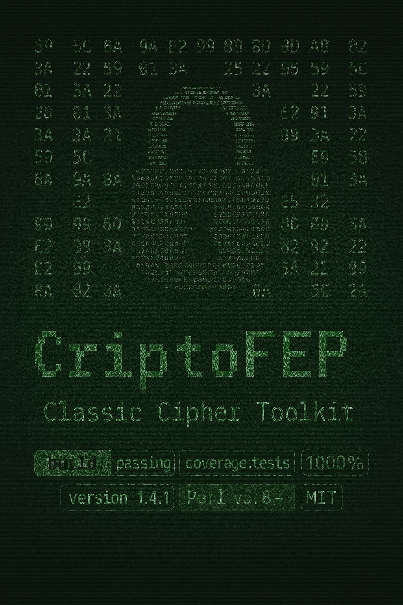

<div align="center">
  
  <h1>CriptoFEP — A Classic Cipher & Analysis Toolkit</h1>
</div>

<div align="center">

[]()
[]()
[]()
[]()
[]()

</div>

<div align="center">

```
   ___|       _)         |           ____|  ____|   _ \  
  |       __|  |  __ \   __|   _ \   |      __|    |   | 
  |      |     |  |   |  |    (   |  __|    |      ___/  
 \____| _|    _|  .__/  \__| \___/  _|     _____| _|     
                 _|                                      
```

</div>

**CriptoFEP** is a powerful, educational, and modular command-line toolkit written in **Perl** for experimenting with classic cryptography. It provides a comprehensive arsenal of historical ciphers, modern encodings, and **cryptanalysis tools**, making it the perfect companion for students, historians, puzzle enthusiasts, and Capture The Flag (CTF) competitors.

---

## 📋 Table of Contents

- [✨ Core Features](#-core-features)
- [📚 Available Algorithms & Tools](#-available-algorithms--tools)
- [🚀 Quick Start](#-quick-start)
- [🛠️ Usage Guide](#️-usage-guide)
  - [Synopsis](#synopsis)
  - [Command-Line Options](#command-line-options)
  - [Practical Examples](#practical-examples)
- [📂 Project Structure](#-project-structure)
- [✅ Roadmap](#-roadmap)
- [🤝 Contributing](#-contributing)
- [📜 License](#-license)

---

## ✨ Core Features

- **Extensive Library**: A vast collection of over 40 classic ciphers and 15+ standard encodings.
- **Triple Modes**: Intelligently separates **Ciphers** (secrecy), **Encodings** (representation), and **Analysis** (cryptanalysis).
- **Cryptanalysis Suite**: Includes tools like Frequency Analysis, Index of Coincidence (IC), and a Polyalphabetic Key Length Detector.
- **Professional CLI**: A robust and intuitive command-line interface with clear, consistent options.
- **File I/O**: Seamlessly processes direct text input or entire files.
- **Full Unicode Support**: Correctly handles a wide range of characters thanks to its UTF-8 architecture.
- **Dynamic Help & Listing**: Integrated `--info`, `--list-ciphers`, and `--list-encodings` flags provide detailed explanations.
- **Modular & Extensible**: Built with a clean architecture in `lib/CriptoFEP/`, making it easy to maintain and extend.

---

## 📚 Available Algorithms & Tools

This is the complete list of algorithms and tools currently supported by CriptoFEP.

<details>
<summary><strong>Click to expand the full list of 40+ Ciphers</strong></summary>

### Ciphers (Algorithms for confidentiality)

| Name               | Requires Key? | Description                                                                |
| -------------------| :-----------: | ---------------------------------------------------------------------------|
| **ADFGX**          |      Yes      | The original 5x5 WWI German field cipher combining Polybius and columnar.  |
| **ADFGVX**         |      Yes      | The advanced 6x6 version of ADFGX, including numbers.                      |
| **Affine**         |      Yes      | A mathematical substitution cipher using `(ax + b) mod 26`.                |
| **Albam**          |      No       | A simple substitution cipher that swaps the two halves of the alphabet.    |
| **AMSCO**          |      Yes      | An irregular columnar transposition using a 1-2 fill pattern.              |
| **Atbah**          |      No       | A simple substitution cipher with a specific, non-sequential mapping.      |
| **Atbash**         |      No       | A simple substitution cipher that reverses the alphabet (A=Z, B=Y...).     |
| **Bacon**          |      No       | A 5-bit binary encoding that maps letters to sequences of 'A's and 'B's.   |
| **Beaufort**       |      Yes      | A reciprocal polyalphabetic cipher, similar to Vigenere (C = K - P).       |
| **Bifid**          |      Yes      | A fractionating cipher combining Polybius with transposition.              |
| **Caesar**         |      No       | The classic shift cipher (fixed shift of 3).                               |
| **Caesar Box**     |      Yes      | A simple columnar transposition where columns are read in natural order.   |
| **Columnar**       |      Yes      | A transposition cipher that rearranges text in columns based on a keyword. |
| **Digrafid**       |      Yes      | An advanced fractionating cipher operating on digraphs with a 25x25 grid.  |
| **Double Columnar**|      Yes      | Applies the Columnar Transposition cipher twice for enhanced security.     |
| **Four-Square**    |      Yes      | A polygraphic cipher using four 5x5 grids to encrypt digraphs.             |
| **Grandpré**       |      Yes      | A progressive-key polyalphabetic cipher (stronger Vigenere).               |
| **Hill**           |      Yes      | A polygraphic cipher using linear algebra (matrix multiplication).         |
| **Keyboard Shift** |      No       | A substitution cipher based on shifting keys on a QWERTY keyboard.         |
| **Morbit**         |      No       | A fractionating cipher that combines Morse code with a simple 3x3 grid.    |
| **Multiplicative** |      Yes      | A mathematical substitution cipher using `(ax) mod 26`.                    |
| **Nihilist**       |      Yes      | A superencipherment combining a Polybius square with a key addition.       |
| **Playfair**       |      Yes      | The first practical polygraphic substitution cipher, using one 5x5 grid.   |
| **Pollux**         |      Yes      | A homophonic cipher that disguises Morse code using a numeric key.         |
| **Porta**          |      Yes      | A reciprocal polyalphabetic cipher using 13 substitution tables.           |
| **Rail Fence**     |      Yes      | A transposition cipher that writes text in a zig-zag pattern.              |
| **Redefence**      |      Yes      | A route cipher that writes text column-by-column and reads row-by-row.     |
| **ROT13**          |      No       | A Caesar cipher with a fixed shift of 13.                                  |
| **ROT47**          |      No       | A Caesar cipher that shifts all printable ASCII characters.                |
| **Route**          |   	Yes	     | A transposition cipher that writes text in a clockwise inward spiral path. |
| **Scytale**        |      No       | An ancient transposition cipher simulating a cylinder (fixed at 5 rows).   |
| **Skip**           |      Yes      | A simple transposition equivalent to a Caesar Box or basic Columnar.       |
| **Three-Square**   |      Yes      | A polygraphic cipher using three 5x5 grids.                                |
| **Trifid**         |      Yes      | An advanced fractionating cipher using a 3x3x3 cube.                       |
| **Turning Grille** |      No       | A transposition cipher using a rotating stencil with a fixed 6x6 grid.     |
| **Two-Square**     |      Yes      | A polygraphic cipher using two 5x5 grids.                                  |
| **VIC**            |      Yes      | A highly complex Cold War spy cipher.                                      |
| **Vigenère(auto)** |      Yes      | The more secure "Autokey" variant of the Vigenère cipher.                  |
| **Vigenère**       |      Yes      | The classic polyalphabetic cipher using a repeating keyword.               |
| **XOR**            |      Yes      | A modern, bitwise symmetric cipher.                                        |

</details>

<details>
<summary><strong>Click to expand the full list of 15+ Encodings</strong></summary>

### Encodings (Standard, keyless mappings for representation)

|    Name     |                              Description                                  |
| :---------- | :------------------------------------------------------------------------ |
| **A1Z26**   | Replaces each letter with its position in the alphabet (A=1, B=2...).     |
| **Base10**  | Converts characters to their standard decimal code point (ASCII/Unicode). |
| **Base16**  | Represents binary data using the 16-character hexadecimal set (0-9, A-F). |
| **Base2**   | Represents data in its fundamental binary format (0s and 1s).             |
| **Base32**  | Represents binary data using a 32-character set (A-Z, 2-7).               |
| **Base64**  | Represents binary data using a 64-character set. Ubiquitous on the web.   |
| **Base8**   | Represents binary data using the 8-character octal set (0-7).             |
| **Braille** | Encodes characters into 8-dot Braille Unicode symbols.                    |
| **Morse**   | The classic dot-and-dash telecommunication code.                          |
| **NATO**    | The standard NATO phonetic alphabet (Alpha, Bravo, Charlie...).           |
| **Navajo**  | The famous word-based code used by the WWII Code Talkers.                 |
| **T9**      | The multi-press keypad encoding from older mobile phones.                 |
| **Tap Code**| A Polybius-based code transmitted via taps, used by prisoners.            |
| **URL**     | Encodes unsafe characters for use in a URL (Percent-Encoding).            |

</details>

<details>
<summary><strong>Click to expand the full list of Cryptanalysis Tools</strong></summary>

### Cryptanalysis Tools (Tools for analyzing and breaking ciphers)

|       Tool     |                                     Description                                       |
| :------------- | :------------------------------------------------------------------------------------ |
| **freq**       | Performs a full frequency analysis of a text, suggesting likely letter substitutions. |
| **ic**         | Calculates the **Index of Coincidence (IC)** to help identify the cipher type.        |
| **poly-detect**| Analyzes text to find the most probable key length of a polyalphabetic cipher.        |
| **digram**     | Performs a frequency analysis on letter pairs (digrams).                              |
| **trigram**    | Performs a frequency analysis on letter trios (trigrams).                             |
| **poly-solve** | Attempts to find the key for a polyalphabetic cipher given a key length.              |

</details>

---

## 🚀 Quick Start

**1. Clone the Repository**
```bash
git clone [https://github.com/felipeandrian/CriptoFEP.git](https://github.com/felipeandrian/CriptoFEP.git)
cd CriptoFEP
````

**2. Display the Help Message**
The first command you should run is `-h` to see all available options.

```bash
perl criptofep.pl -h
```

**3. List Available Algorithms**
To see a quick overview of all supported algorithms, use the list commands.

```bash
perl criptofep.pl --list-ciphers
perl criptofep.pl --list-encodings
```

-----

## 🛠️ Usage Guide

### Synopsis

CriptoFEP operates in three distinct modes: **Cipher**, **Encoding**, and **Analysis**.

```bash
# Cipher Mode (for algorithms that hide information)
perl criptofep.pl -c <cipher> [-e|-d] [options...] ["text" | --in <file>]

# Encoding Mode (for standard, keyless representations)
perl criptofep.pl -m <mapping> [--encode|--decode] ["text" | --in <file>]

# Analysis Mode (for cryptanalysis tools)
perl criptofep.pl -a <tool> [--lang <lg>] ["text" | --in <file>]

# Utility Mode (for helper tools)
perl criptofep.pl --validate-key <cipher> <key>
```

### Command-Line Options

#### **General Options**

| Option             | Description                                       |
| ------------------ | ------------------------------------------------- |
| `-h`, `--help`     | Display the full help message and exit.           |
| `--list-ciphers`   | Display all ciphers                               |
| `--list-encodings` | Display all encodings                             |
| `--in <FILE>`      | Read input text from the specified file.          |
| `--out <FILE>`     | Write the output to the specified file.           |

#### **Mode Selection (Choose ONE)**

| Option                  | Description                                                                |
| ----------------------- | ---------------------------------------------------------------------------|
| `-c`, `--cipher <NAME>` | Selects **Cipher Mode** and specifies the cipher.                          |
| `-m`, `--mapping <NAME>`| Selects **Encoding Mode** and specifies the mapping.                       |
| `-a`, `--analyze <TOOL>`| Select **Analysis Mode** (e.g., `freq`, `ic`, `poly-detect`,`poly-solve`). |
| `--validate-key <NAME>` |	Select Utility Mode to validate a key (e.g., hill).                        |

#### **Actions (Choose ONE per mode)**

| Option            | Description                                                         |
| ----------------- | ------------------------------------------------------------------- |
| `-e`, `--encrypt` | Cipher mode Encrypt the input text.                                 |
| `-d`, `--decrypt` | Cipher mode Decrypt the input text.                                 |
| `-enc`,`--encode` | Encoding mode Encode the input text.                                |
| `-dec`,`--decode` | Encoding mode Decode the input text.                                |
| `--info`          | Display detailed information about the selected algorithm.          |
| `--lang <lg>`     | Specify the language profile for analysis (e.g., `en`, `pt`, `fr`). |
| `--klen <LEN>`	| Specify the key length (required for poly-solve).                   |

#### **Cipher-Specific Keys**

| Option                | Description                                                          |
| --------------------- | -------------------------------------------------------------------- |
| `-k`, `--key <KEY>`   | Provide the primary secret key.                                      |
| `-k2`, `--key2 <KEY>` | Provide the second key (for `doublecolumnar`, `twosquare`, etc.).    |
| `-k3`, `--key3 <KEY>` | Provide the third key (for 'threesquare').                           |
| `--grid-key <KEY>`    | Provide the grid generation key (for `adfgx`, `adfgvx`).             |
| `--pattern-key <VAL>` | Provide the pattern key (for `amsco`, e.g., "1221").                 |
| `--date <DATE>`       | Provide the date (for 'vic' cipher).                                 |

### Practical Examples

**1. Encrypt with the VIC cipher**

```bash
perl criptofep.pl -c vic -e -k "A SIN TO SIN" --date "171025" "ATTACK AT DAWN"
```

**2. Decode a Base64 string**

```bash
perl criptofep.pl -m base64 --decode "SGVsbG8gV29ybGQ="
```

**3. Analyze a ciphertext to find its key length**

```bash
perl criptofep.pl -a poly-detect --lang en "VPOVEWZTVMVIXRKSVIUGZGSVGIZBHOLYRZMZKKILEZXS"
```

**4. Check the Index of Coincidence of a text**

```bash
perl criptofep.pl -a ic "VPOVEWZTVMVIXRKSVIUGZGSVGIZBHOLYRZMZKKILEZXS"
```

**5. Encode a file's content using the NATO alphabet and save it to another file**

```bash
perl criptofep.pl -m nato --encode --in message.txt --out nato_encoded.txt
```

**6. Get detailed information about the historic Playfair cipher**

```bash
perl criptofep.pl -c playfair --info
```

**7. Break a Vigenère Cipher (Two-Step Attack)**

Step 1: Find the key length with poly-detect.

```bash
perl criptofep.pl -a poly-detect "GZTZIWTTZBVVMPMVVLJRIVEXSOTUDXCZLZXTHSMIRLTDHCZPVVCXUZSPVSNSVLSOIFVIIH
KJEYIEVIIGKKEIGKHPJWUHFPREPOIETIEH"
```
(Output: ...The most probable fundamental key length is 5.)

Step 2: Solve for the key using the length you found.

```bash
perl criptofep.pl -a poly-solve -klen 5 "GZTZIWTTZBVVMPMVVLJRIVEXSOTUDXCZLZXTHSMIRLTDHCZPVVCXUZSPVSNSVLSOIFVIIH
KJEYIEVIIGKKEIGKHPJWUHFPREPOIETIEH"
```
(Output: ...The most probable key is 'CHAVE'.)
-----

## 📂 Project Structure

```
.
├── 📜 criptofep.pl          # The main command-line interface (controller)
│
├── 📂 lib/
│   └── 📂 CriptoFEP/       # Directory for all Perl modules (the core logic)
│       ├── 📜 Utils.pm     # Shared helper functions (e.g., text normalization)
│       ├── 📜 Analyzer.pm  # The cryptanalysis module
│       ├── 📜 Cesar.pm     # Each cipher has its own dedicated module...
│       ├── 📜 Morse.pm     # Each encoding has its own dedicated module...
│       └── ...           # ...and so on for all algorithms
│
├── 🔬 t/                   # Directory for the automated test suite
│   ├── 📜 01-cesar.t     # Each module has a corresponding test file...
│   └── ...
│
├── 📄 README.md              # This documentation file
│
└── ⚖️ LICENSE               # The MIT License for the project
```

-----

## ✅ Roadmap

  - [x] Implement a comprehensive library of classic ciphers and encodings.
  - [x] Create a professional, modular architecture.
  - [x] Add a robust command-line interface with file I/O and dynamic help.
  - [x] Implement a powerful cryptanalysis suite (Freq Analysis, IC, Key Length Detector).
  - [ ] **Next Up**: Complete the automated test suite to achieve 100% coverage.
  - [ ] Add more unique and challenging ciphers (e.g., Book Cipher, Enigma).
  - [ ] Create a `LEIA-ME.md` file with a full Portuguese translation.

-----

## 🤝 Contributing

Contributions are what make the open source community such an amazing place to learn, inspire, and create. Any contributions you make are **greatly appreciated**.

If you have a suggestion that would make this better, please fork the repo and create a pull request. You can also simply open an issue with the tag "enhancement".

-----

## 📜 License

This project is licensed under the MIT License. See the [LICENSE](LICENSE) file for details.
